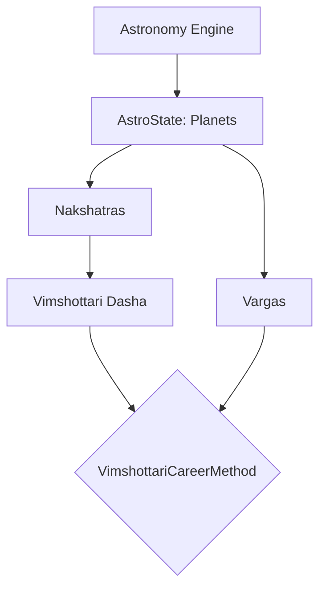
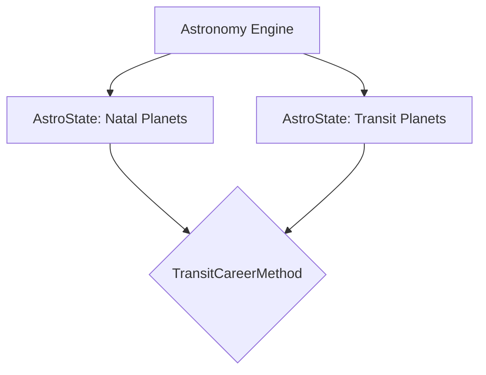
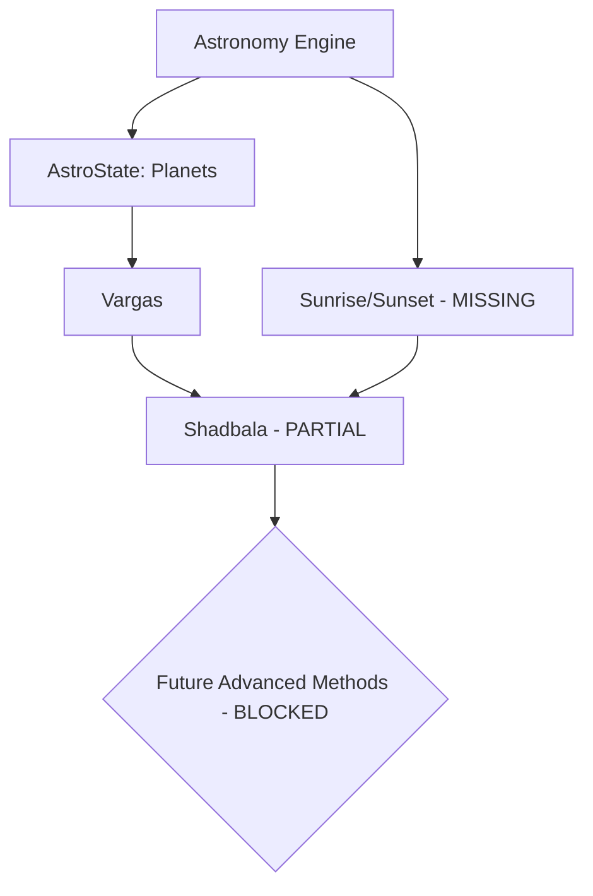

# Calculation Dependency Graph

**Status:** CANONICAL

To prevent incomplete foundational calculations from silently contaminating higher-level methodologies, dependencies must strictly follow this directed graph. A downstream node inherits the lowest maturity status of its ancestors.

## Core Dependency Paths

### Method A (Vimshottari Career)

### Method B (Gochara Transit)

### Shadbala (Partial)

*Note: Any method relying on Shadbala is currently blocked from PRODUCTION status until the missing `I` dependencies are fulfilled.*
